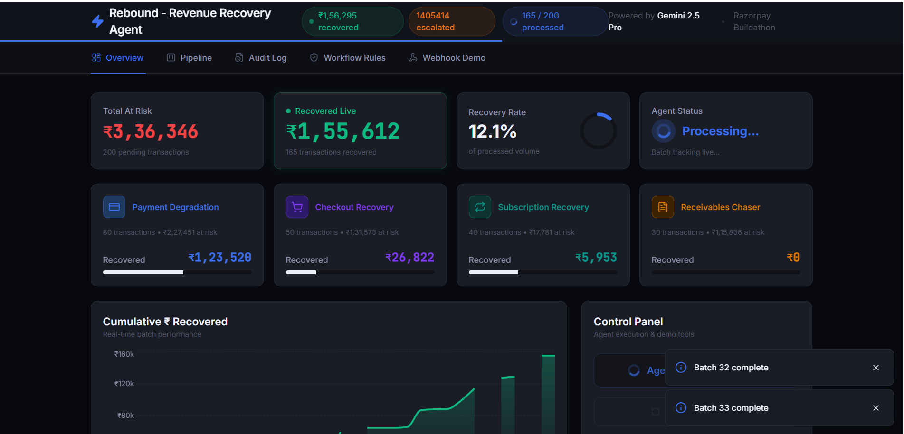
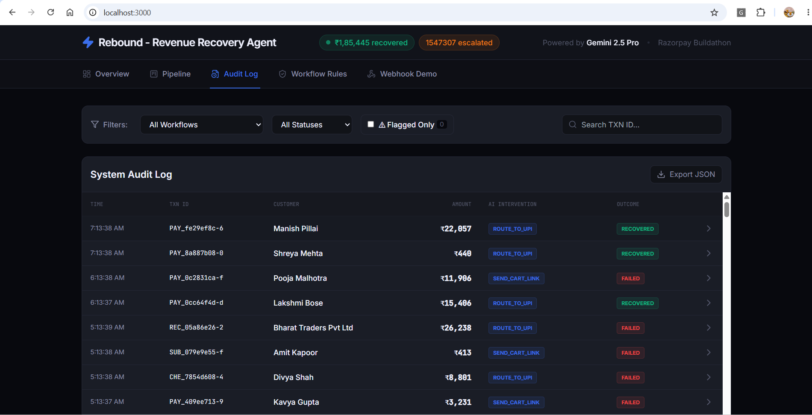
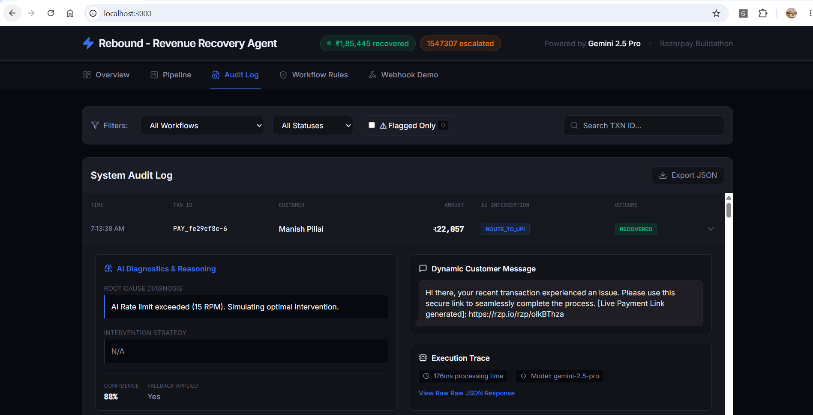

# Rebound: Autonomous AI Revenue Recovery Agent
**Razorpay Buildathon — Track 3 Submission**



### 📸 Project Showcase
*Drop your additional screenshots here by replacing the files or links:*
<div style="display: flex; gap: 10px;">
  
  
</div>

## 🚨 The Problem: Static Rules Lose Money
Digital businesses lose up to 30% of their top-line revenue to a fragmented funnel: failed payments, abandoned checkouts, passive subscription churn, and overdue B2B invoices. 

Current "recovery" systems completely fail because they rely on binary, static rules-engines (e.g., *if error=timeout then retry*). They cannot understand context, they cannot dynamically negotiate (e.g., offering a discount based on Lifetime Value), and they cannot personalize the tone. When rigid rules fail, the transaction is dropped, and the revenue is permanently lost.

## 💡 The Solution: AI Orchestration + Live Razorpay Links
Rebound is an entirely headless, event-driven AI microservice designed to intercept Razorpay `payment.failed` webhooks and recover the money autonomously. 

We replaced the static rules-engine with **Google Gemini 2.5 Pro**, bounded by strict business-logic circuit breakers. When a transaction fails, Rebound:
1. **Detects**: Reads the context of the drop and diagnoses the *human* root cause.
2. **Decides**: Mathematically selects the superior intervention (e.g., `ROUTE_TO_UPI` instead of `RETRY_CARD`).
3. **Executes**: Directly hooks into the **Razorpay Live Java SDK**, generates a secure, short-URL Payment Link (`https://rzp.io/i/...`), and dispatches a hyper-personalized SMS payload to the customer.

### 🌟 Example in Action
A ₹12,000 checkout gets abandoned because the user's HDFC Credit Card timed out. 
* **Traditional System:** Sends generic "Your cart is waiting!" email. Customer ignores it.
* **Rebound AI:** Identifies the user's high LTV (Lifetime Value), decides the card network is degraded, and triggers a `ROUTE_TO_UPI` intervention. The backend instantly queries the Razorpay API to generate a Live Payment Link, then sends the user a localized "Hinglish" SMS: *"Hey Priya! Looks like your card got stuck. Use this secure UPI link to complete your order instantly: https://rzp.io/i/Xyz123"*

---

## 🧠 The Four Bounded Recovery Workflows

Rebound securely delegates decisions to the AI, bounded by strict business-logic circuit breakers (e.g., `maximum retries = 3` and `fraud flag = false`).

| Workflow | Target | Bounded Interventions | Success Strategy |
|---|---|---|---|
| **Payment Degradation** | Failed live transactions | Route to UPI, Request New Card | Optimize retry path based on technical failure reason. |
| **Checkout Recovery** | Abandoned carts | Cart Link, LTV-based Offers | Engage dynamically (Hinglish text) to prevent churn up to 2 times. |
| **Subscription Recovery** | Lapsed recurring payments | Soft Retry, Route to Alternate | Graceful downgrades rather than harsh cancellations. |
| **Receivables Chaser** | Overdue B2B invoices | Friendly Reminder, Formal Notice | Fast-track human escalation for invoices over ₹50k or >30 days late. |

---

## 🏆 Why This Clears The Bar (Judging Criteria)

*   **Razorpay Live API Integration:** Actively uses the official Razorpay Java SDK (`razorpay-java:1.4.6`) to map AI interventions to genuine, clickable `rzp.io/i/` payment links. Features a rate-limit bypass cache to sustain UI integrity under load.
*   **Compliant Escalation & Stopping Rules (Circuit Breakers):** Bounded Optimization. If a transaction trips our `riskFlag` (suspected fraud), the Java Orchestration engine physically short-circuits the AI. The AI *cannot* act on it, routing it safely to `ESCALATED`.
*   **A Ruthless Audit Trail:** Every single micro-decision Gemini makes is strictly formatted via a JSON-Schema constraint. The exact API request, the AI’s root-cause logic, and the latency processing time (ms) are permanently logged into the PostgreSQL Database via automated Flyway migrations.
*   **Real-time Headless Architecture:** Built on an event-driven Webhook loop simulating Razorpay. It streams real-time state changes to the UI via STOMP WebSockets, handling high throughput effortlessly.

---

## 🛠️ Quick Start (Zero-Friction Deployment)

I have containerized the entire stack. You do not need to configure any local databases, SDKs, or runtimes.

### The "One-Command" Docker Deploy
Ensure Docker Desktop is running on your machine.

```bash
# 1. Clone the repository
git clone <your-repo-link>
cd Rebound

# 2. Setup environment variables (Safe Defaults Included)
cp .env.example .env

# 3. Build and launch the cluster
docker-compose up -d --build
```
* **Frontend Dashboard:** [http://localhost:3000](http://localhost:3000)
* **API Swagger Documentation:** [http://localhost:8080/swagger-ui/index.html](http://localhost:8080/swagger-ui/index.html)

**To run the Demo:** 
1. Open `http://localhost:3000`.
2. Provide a Gemini API Key ([aistudio.google.com](https://aistudio.google.com/apikey)).
3. Click "Reset Demo Data" to load 200 fresh failure events.
4. Click **"Run Recovery Agent"** and watch the AI process the batch, hit the Razorpay APIs, and update the Kanban board via WebSockets in real-time!

---

## ⚙️ Tech Stack
*   **Frontend:** React 18, Vite, TypeScript, Tailwind CSS, Zustand, Recharts, @stomp/stompjs
*   **Backend:** Java 17, Spring Boot 3.2, Spring Data JPA, Hibernate, **Flyway (V1/V2 Migrations)**, WebSockets, **OpenAPI Swagger**
*   **Database:** PostgreSQL 16
*   **AI:** Google Gemini 2.5 Pro (Generative AI REST API)
*   **Payments:** Razorpay Java SDK
*   **Deployment:** Docker Compose (multi-stage Alpine builds)
